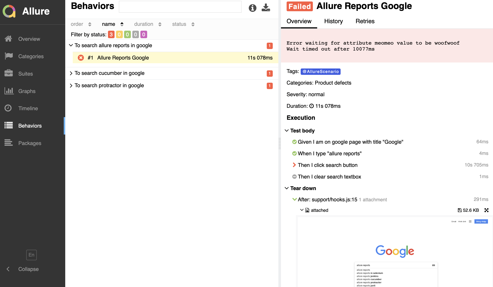
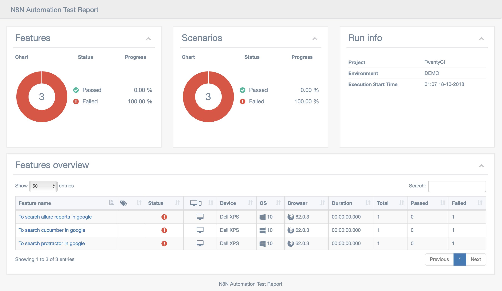

# N8N Automated Testing Framework in NodeJS


**Features**

* Robust actions like `click`, `sendKeys` or `hover` which wait for their elements before the action is performed
* Lots of `waitfor…` functions to avoid `sleep`
* Helper to open and close windows, tabs, popups, etc
* Most of the actions have a retry logic inside, which retries the action 3 (or configurable number of) times before an error is thrown
* Ready for tests written with [`async` / `await`](https://github.com/angular/protractor/blob/master/docs/async-await.md) (every function returns a promise)
* Beatiful reporting with `CI integrate ready` with Allure2 / Protractor Multiple Cucumber Html Reporter 
## Table of Contents
* [Installation](#installation)
* [Structure](#structure)
* [Browser Helper Library](#lib)


<a id="installation"></a>
## Installation
```bash
git clone https://github.com/hangnhat57/N8N-BDD-Automated-Function-Testing-Framework-NodeJS.git n8n-function-test
cd n8n-function-test 
npm install
cp example .env
docker-compose up -d
npm run test
```


<a id="structure"></a>
## Framework Structure:
```
├── config  => Includes config for execution e.g : Urls, Single - Parallel exec
├── features => Includes BDD feature files
├── browserlib => Includes util functions to interact with browser 
├── pages => Includes page object model files
├── reports => Includes reports after executions
│   ├── allure-results -- Allure 2 test report folder
│   └── html - Protractor Multiple Cucumber Html Report - Very good for cross browser
├── stepDefinitions => Includes step files for Cucumber
└── support => Include util functions for test runner
```
<a id="report"></a>
## Sample Report
### Allure

### HTML

<a id="lib"></a>
## Browser Helper Library
### Actions 

<a id="click"></a>

####  click

▸ **click**(target: * `Element` &#124; `Locator` &#124; `Xpath`*, timeout?: *`number`*, tryCount?: *`number`*)

Waits for an element to be displayed and clickable, and click on it. If the click fails, `tryCount` retries are performed.

**Parameters:**

| Param | Type | Default value | Description |
| ------ | ------ | ------ | ------ |
| target |  `Element` &#124; `Locator` &#124; `Xpath`| - |  Target element |
| `Default value` timeout | `number` |  DEFAULT_TIMEOUT |  Timeout in milliseconds to wait for the target |
| `Default value` tryCount | `number` |  DEFAULT_RETRIES |  Retry counter for the recursion |


___
<a id="hover"></a>

####  hover

▸ **hover**(target: * `Element` &#124; `Locator` &#124; `Xpath`*, timeout?: *`number`*)

Waits for an element to be displayed and positions the pointer inside that element.

**Parameters:**

| Param | Type | Default value | Description |
| ------ | ------ | ------ | ------ |
| target |  `Element` &#124; `Locator` &#124; `Xpath`| - |  Target element |
| `Default value` timeout | `number` |  DEFAULT_TIMEOUT |  Timeout in milliseconds to wait for the target |


___
<a id="selectoption"></a>

####  selectOption

▸ **selectOption**(option: * `Element` &#124; `Locator` &#124; `Xpath`*, timeout?: *`number`*)

Select an `<option>`. If the selection fails, 3 retries are performed.

**Parameters:**

| Param | Type | Default value | Description |
| ------ | ------ | ------ | ------ |
| option |  `Element` &#124; `Locator` &#124; `Xpath`| - |  Target <option> element |
| `Default value` timeout | `number` |  DEFAULT_TIMEOUT |  Timeout in milliseconds to wait for the target |


___
<a id="selectoptionbyindex"></a>

####  selectOptionByIndex

▸ **selectOptionByIndex**(select: * `Element` &#124; `Locator` &#124; `Xpath`*, index: *`number`*, timeout?: *`number`*)

Select an `<option>` ancestor of a particular `<select>` element by its index. All options are collected by `tagName === 'option'`, skipping `<optgroup>` or similar elements. After that the index is selected. If the selection fails, 3 retries are performed.

**Parameters:**

| Param | Type | Default value | Description |
| ------ | ------ | ------ | ------ |
| select |  `Element` &#124; `Locator` &#124; `Xpath`| - |  Parent <select> element |
| index | `number` | - |  Index of the option which should be selected |
| `Default value` timeout | `number` |  DEFAULT_TIMEOUT |  Timeout in milliseconds to wait for the target |


___
<a id="selectoptionbytext"></a>

####  selectOptionByText

▸ **selectOptionByText**(select: * `Element` &#124; `Locator` &#124; `Xpath`*, text: *`string`*, timeout?: *`number`*)

Select an `<option>` ancestor of a particular `<select>` element by its content. The option is identified by Protractor's `cssContainingText` (partial match: `selectOptionByText('bar')` matches `<option>foobar</option>` too). If the selection fails, 3 retries are performed.

**Parameters:**

| Param | Type | Default value | Description |
| ------ | ------ | ------ | ------ |
| select |  `Element` &#124; `Locator` &#124; `Xpath`| - |  Parent <select> element |
| text | `string` | - |  Text of the option which should be selected |
| `Default value` timeout | `number` |  DEFAULT_TIMEOUT |  Timeout in milliseconds to wait for the target |


___
<a id="sendkeys"></a>

####  sendKeys

▸ **sendKeys**(target: * `Element` &#124; `Locator` &#124; `Xpath`*, value: *`string`*, timeout?: *`number`*, tryCount?: *`number`*)

Wait for an `<input>` element to be displayed, then clear its content, and perform key strokes for the passed value. If sendKeys fails, `tryCount` retries are performed.

**Parameters:**

| Param | Type | Default value | Description |
| ------ | ------ | ------ | ------ |
| target |  `Element` &#124; `Locator` &#124; `Xpath`| - |  Target element |
| value | `string` | - |  Input value which should be sent as key inputs |
| `Default value` timeout | `number` |  DEFAULT_TIMEOUT |  Timeout in milliseconds to wait for the target |
| `Default value` tryCount | `number` |  DEFAULT_RETRIES |  Retry counter for the recursion |


___

### Waits 

<a id="waitforattributematch"></a>

####  waitForAttributeMatch

▸ **waitForAttributeMatch**(target: * `Element` &#124; `Locator` &#124; `Xpath`*, attr: *`string`*, value: *`RegExp`*, timeout?: *`number`*): `Promise`<`boolean`>

Wait for an element's attribute value to match a regular expression.

**Parameters:**

| Param | Type | Default value | Description |
| ------ | ------ | ------ | ------ |
| target |  `Element` &#124; `Locator` &#124; `Xpath`| - |  Target element |
| attr | `string` | - |  Attribute name |
| value | `RegExp` | - |  RegExp which the attribute's value should match |
| `Default value` timeout | `number` |  DEFAULT_TIMEOUT |  Timeout in milliseconds |

**Returns:** `Promise`<`boolean`>

___
<a id="waitforattributetobe"></a>

####  waitForAttributeToBe

▸ **waitForAttributeToBe**(target: * `Element` &#124; `Locator` &#124; `Xpath`*, attr: *`string`*, value: *`string`*, timeout?: *`number`*): `Promise`<`boolean`>

Wait for an element's attribute to have the given value.

**Parameters:**

| Param | Type | Default value | Description |
| ------ | ------ | ------ | ------ |
| target |  `Element` &#124; `Locator` &#124; `Xpath`| - |  Target element |
| attr | `string` | - |  Attribute name |
| value | `string` | - |  Value which the attribute should have |
| `Default value` timeout | `number` |  DEFAULT_TIMEOUT |  Timeout in milliseconds |

**Returns:** `Promise`<`boolean`>

___
<a id="waitforelementcounttobe"></a>

####  waitForElementCountToBe

▸ **waitForElementCountToBe**(target: * `ElementArrayFinder` &#124; `Locator` &#124; `string`*, expected: *`number`*, timeout?: *`number`*): `Promise`<`boolean`>

Waits that a selector resolves to the expected number of elements. Useful e.g. to verify that the expected number of items have been added to a list.

**Parameters:**

| Param | Type | Default value | Description |
| ------ | ------ | ------ | ------ |
| target |  `ElementArrayFinder` &#124; `Locator` &#124; `string`| - |  Target selector or ElementArryFinder |
| expected | `number` | - |  Number of the expected elements |
| `Default value` timeout | `number` |  DEFAULT_TIMEOUT |  Timeout in milliseconds |

**Returns:** `Promise`<`boolean`>

___
<a id="waitforelementcounttobegreaterthan"></a>

####  waitForElementCountToBeGreaterThan

▸ **waitForElementCountToBeGreaterThan**(target: * `ElementArrayFinder` &#124; `Locator` &#124; `string`*, expected: *`number`*, timeout?: *`number`*): `Promise`<`boolean`>

Waits that a selector resolves to more than the expected count of elements. Useful e.g. to verify that at least some number of items have been added to a list.

**Parameters:**

| Param | Type | Default value | Description |
| ------ | ------ | ------ | ------ |
| target |  `ElementArrayFinder` &#124; `Locator` &#124; `string`| - |  Target selector or ElementArrayFinder |
| expected | `number` | - |  Expected number of elements |
| `Default value` timeout | `number` |  DEFAULT_TIMEOUT |  Timeout in milliseconds |

**Returns:** `Promise`<`boolean`>

___
<a id="waitforelementcounttobelessthan"></a>

####  waitForElementCountToBeLessThan

▸ **waitForElementCountToBeLessThan**(target: * `ElementArrayFinder` &#124; `Locator` &#124; `string`*, expected: *`number`*, timeout?: *`number`*): `Promise`<`boolean`>

Waits that a selector resolves to less than the expected count of elements. Useful e.g. to verify that at least some elements have been removed from a list.

**Parameters:**

| Param | Type | Default value | Description |
| ------ | ------ | ------ | ------ |
| target |  `ElementArrayFinder` &#124; `Locator` &#124; `string`| - |  Target selector or ElementArrayFinder |
| expected | `number` | - |  Should be less than the expected number of elements |
| `Default value` timeout | `number` |  DEFAULT_TIMEOUT |  Timeout in milliseconds |

**Returns:** `Promise`<`boolean`>

___
<a id="waitfortextmatch"></a>

####  waitForTextMatch

▸ **waitForTextMatch**(target: * `Element` &#124; `Locator` &#124; `Xpath`*, value: *`RegExp`*, timeout?: *`number`*): `Promise`<`boolean`>

Wait for an element's text content to match a regular expression.

**Parameters:**

| Param | Type | Default value | Description |
| ------ | ------ | ------ | ------ |
| target |  `Element` &#124; `Locator` &#124; `Xpath`| - |  - |
| value | `RegExp` | - |  The RegExp which the content of the target should match |
| `Default value` timeout | `number` |  DEFAULT_TIMEOUT |  Timeout in milliseconds |

**Returns:** `Promise`<`boolean`>

___
<a id="waitfortexttobe"></a>

####  waitForTextToBe

▸ **waitForTextToBe**(target: * `Element` &#124; `Locator` &#124; `Xpath`*, value: *`string`*, timeout?: *`number`*): `Promise`<`boolean`>

Wait for an element's text content to equal the given value.

**Parameters:**

| Param | Type | Default value | Description |
| ------ | ------ | ------ | ------ |
| target |  `Element` &#124; `Locator` &#124; `Xpath`| - |  Target element |
| value | `string` | - |  The string we are waiting for |
| `Default value` timeout | `number` |  DEFAULT_TIMEOUT |  Timeout in milliseconds |

**Returns:** `Promise`<`boolean`>

___
<a id="waitforurlmatch"></a>

####  waitForUrlMatch

▸ **waitForUrlMatch**(value: *`RegExp`*, timeout?: *`number`*): `Promise`<`boolean`>

Wait for the browser's URL to match a regular expression.

**Parameters:**

| Param | Type | Default value | Description |
| ------ | ------ | ------ | ------ |
| value | `RegExp` | - |  RegExp which the URL should match |
| `Default value` timeout | `number` |  DEFAULT_TIMEOUT |  Timeout in milliseconds |

**Returns:** `Promise`<`boolean`>

___
<a id="waitforwindowcount"></a>

####  waitForWindowCount

▸ **waitForWindowCount**(count: *`number`*, timeout?: *`number`*): `Promise`<`boolean`>

Waits for a window count. Useful e.g. for confirming that a popup window was opened.

**Parameters:**

| Param | Type | Default value | Description |
| ------ | ------ | ------ | ------ |
| count | `number` | - |  Expected number of windows |
| `Default value` timeout | `number` |  DEFAULT_TIMEOUT |  Timeout in milliseconds |

**Returns:** `Promise`<`boolean`>

___
<a id="waittobedisplayed"></a>

####  waitToBeDisplayed

▸ **waitToBeDisplayed**(target: * `Element` &#124; `Locator` &#124; `Xpath`*, timeout?: *`number`*): `Promise`<`boolean`>

Wait for an element to be displayed. Displayed means that it is part of the DOM **and** visible.

**Parameters:**

| Param | Type | Default value | Description |
| ------ | ------ | ------ | ------ |
| target |  `Element` &#124; `Locator` &#124; `Xpath`| - |  - |
| `Default value` timeout | `number` |  DEFAULT_TIMEOUT |  Timeout in milliseconds |

**Returns:** `Promise`<`boolean`>

___
<a id="waittobenotdisplayed"></a>

####  waitToBeNotDisplayed

▸ **waitToBeNotDisplayed**(target: * `Element` &#124; `Locator` &#124; `Xpath`*, timeout?: *`number`*): `Promise`<`boolean`>

Wait for an element to be not displayed. An element which is not displayed could still be part of the DOM, but is hidden by a css rule.

**Parameters:**

| Param | Type | Default value | Description |
| ------ | ------ | ------ | ------ |
| target |  `Element` &#124; `Locator` &#124; `Xpath`| - |  Target element |
| `Default value` timeout | `number` |  DEFAULT_TIMEOUT |  Timeout in milliseconds |

**Returns:** `Promise`<`boolean`>

___
<a id="waittobenotpresent"></a>

####  waitToBeNotPresent

▸ **waitToBeNotPresent**(target: * `Element` &#124; `Locator` &#124; `Xpath`*, timeout?: *`number`*): `Promise`<`boolean`>

Wait for an element not to be present. Not present means that this element does not exist in the DOM.

**Parameters:**

| Param | Type | Default value | Description |
| ------ | ------ | ------ | ------ |
| target |  `Element` &#124; `Locator` &#124; `Xpath`| - |  - |
| `Default value` timeout | `number` |  DEFAULT_TIMEOUT |  Timeout in milliseconds |

**Returns:** `Promise`<`boolean`>

___
<a id="waittobepresent"></a>

####  waitToBePresent

▸ **waitToBePresent**(target: * `Element` &#124; `Locator` &#124; `Xpath`*, timeout?: *`number`*): `Promise`<`boolean`>

Wait for an element to be present. Present means the element is part of the DOM, but still might be hidden by CSS rules.

**Parameters:**

| Param | Type | Default value | Description |
| ------ | ------ | ------ | ------ |
| target |  `Element` &#124; `Locator` &#124; `Xpath`| - |  Target element |
| `Default value` timeout | `number` |  DEFAULT_TIMEOUT |  Timeout in milliseconds |

**Returns:** `Promise`<`boolean`>

___

### Values 

<a id="getelementattributevalue"></a>

####  getElementAttributeValue

▸ **getElementAttributeValue**(target: * `Element` &#124; `Locator` &#124; `Xpath`*, attr: *`string`*, timeout?: *`number`*): `Promise`<`string`>

Waits for the element to be present, and resolves to the attribute's value.

**Parameters:**

| Param | Type | Default value | Description |
| ------ | ------ | ------ | ------ |
| target |  `Element` &#124; `Locator` &#124; `Xpath`| - |  Target element |
| attr | `string` | - |  Attribute name to look for |
| `Default value` timeout | `number` |  DEFAULT_TIMEOUT |  Timeout in milliseconds to wait for the target |

**Returns:** `Promise`<`string`>

___
<a id="gettext"></a>

####  getText

▸ **getText**(target: * `Element` &#124; `Locator` &#124; `Xpath`*, timeout?: *`number`*, tryCount?: *`number`*): `Promise`<`string`>

Wait for an element to be displayed, and resolves to the text in that element. If `getText` fails, `tryCount` retries are performed.

**Parameters:**

| Param | Type | Default value | Description |
| ------ | ------ | ------ | ------ |
| target |  `Element` &#124; `Locator` &#124; `Xpath`| - |  Target element |
| `Default value` timeout | `number` |  DEFAULT_TIMEOUT |  Timeout in milliseconds to wait for the target |
| `Default value` tryCount | `number` |  DEFAULT_RETRIES |  Retry counter for the recursion |

**Returns:** `Promise`<`string`>

___
<a id="getwindowhandlescount"></a>

####  getWindowHandlesCount

▸ **getWindowHandlesCount**(): `Promise`<`number`>

Resolves to the current window count. Windows includes windows, tabs, etc.

**Returns:** `Promise`<`number`>

___

### Window 

<a id="closewindow"></a>

####  closeWindow

▸ **closeWindow**(index?: *`number`*)

Closes a browser window, popup, or tab identified by its zero-based index. If two windows are open and the second window is to be closed, the index should be 1.

**Parameters:**

| Param | Type | Default value | Description |
| ------ | ------ | ------ | ------ |
| `Default value` index | `number` | 0 |  The index of the Window |


___
<a id="openurlinnewtab"></a>

####  openUrlInNewTab

▸ **openUrlInNewTab**(url: *`string`*): `Promise`<`boolean`>

Opens the passed URL in a new tab.

**Parameters:**

| Param | Type | Description |
| ------ | ------ | ------ |
| url | `string` |  The URL to be opened in the window or tab |

**Returns:** `Promise`<`boolean`>

___
<a id="scrollbottom"></a>

####  scrollBottom

▸ **scrollBottom**()

Scrolls to the bottom of the window.


___
<a id="scrolltop"></a>

####  scrollTop

▸ **scrollTop**()

Scrolls to the top of the window.


___

### Utils 

<a id="flowlog"></a>

####  flowLog

▸ **flowLog**(message: *`string`*)

Logs a message in the flow of protractor. This means that the log message appears in the correct order as the actions and tests are performed, and not like regular log output at the test initialization.

**Parameters:**

| Param | Type | Description |
| ------ | ------ | ------ |
| message | `string` |  Text to be logged to the console in the control flow |


___
<a id="getelementarrayfinder"></a>

####  getElementArrayFinder

▸ **getElementArrayFinder**(target: * `ElementArrayFinder` &#124; `Locator` &#124; `string`*): `ElementArrayFinder`

Constructs an ElementArrayFinder from various target types.

**Parameters:**

| Param | Type | Description |
| ------ | ------ | ------ |
| target |  `ElementArrayFinder` &#124; `Locator` &#124; `string`|  Target element |

**Returns:** `ElementArrayFinder`

___
<a id="getElement"></a>

####  getElement

▸ **getElement**(target: * `Element` &#124; `Locator` &#124; `string`*): `Element`

Constructs an Element from various target types.

**Parameters:**

| Param | Type | Description |
| ------ | ------ | ------ |
| target |  `Element` &#124; `Locator` &#124; `Xpath`|  Target element |

**Returns:** `Element`

___
<a id="log"></a>

####  log

▸ **log**(message: *`string`*, ignoreDebug?: *`boolean`*): `void`

Logs a message to the console if debugging is enabled.

**Parameters:**

| Param | Type | Default value | Description |
| ------ | ------ | ------ | ------ |
| message | `string` | - |  Text to be logged to the console |
| `Default value` ignoreDebug | `boolean` | false |  Force log message to be logged, regardless of debug settings |

**Returns:** `void`

___
<a id="refresh"></a>

####  refresh

▸ **refresh**(reason: *`string`*)

Performs a page reload and displays a message in the flow log why the reload was necessary.
*__see__*: flowLog

**Parameters:**

| Param | Type | Description |
| ------ | ------ | ------ |
| reason | `string` |  Text to be logged to the flow log |


___
<a id="sleep"></a>

####  sleep

▸ **sleep**(time: *`number`*, message?: *`string`*)

Performs a browser sleep. Normally it should be avoided because of its performance impact, and replaced by one of the `waitTo…` functions wherever possible. If `sleep` is still necessary, a reason can be displayed in the flow log.

**Parameters:**

| Param | Type | Description |
| ------ | ------ | ------ |
| time | `number` |  Time in milliseconds to sleep |
| `Optional` message | `string` |  Text which explains why the sleep was necessary |


___


